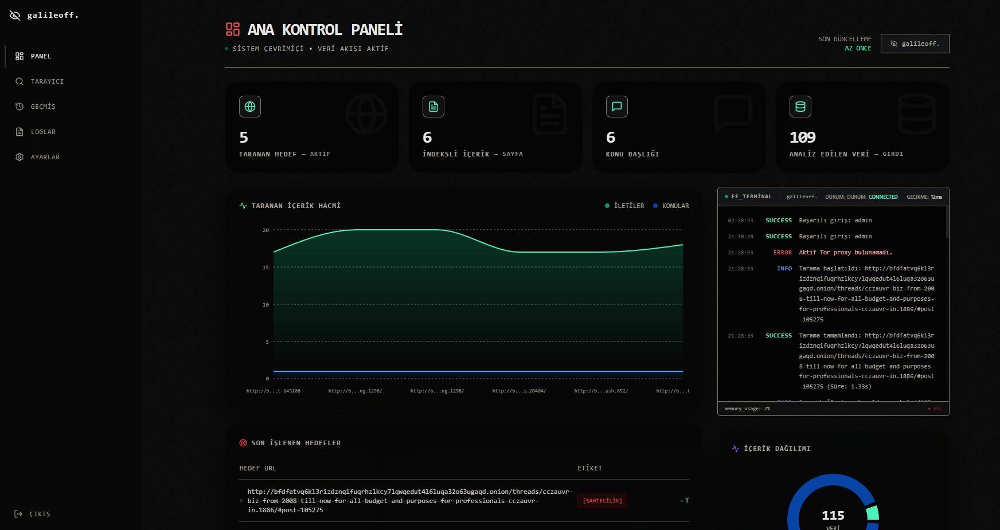
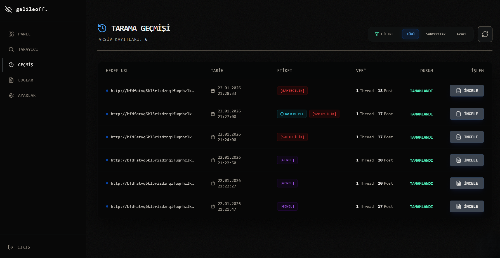
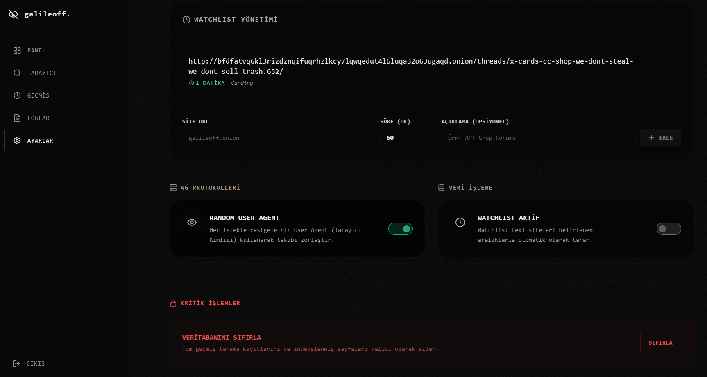
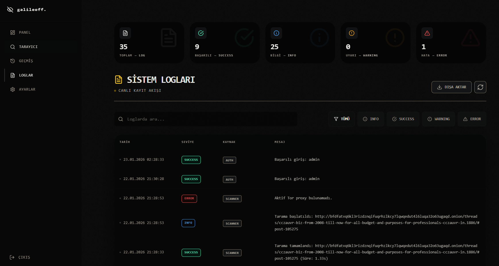

<div align="center">



<br/>


<h3 align="center">galileoff-InteractiveScraper</h3>
*Siber Vatan Programı Yıldız CTI Ekibi görevi kapsamında geliştirilmiştir.*
<p align="center">
  <a href="#-özellikler">🚀 Özellikler</a> •
  <a href="#-teknolojiler">🛠️ Teknolojiler</a> •
  <a href="#-kurulum-ve-çalıştırma">📦 Kurulum</a> •
  <a href="#-api-dokümantasyonu">📖 API</a> •
  <a href="#-ekran-görüntüleri">📸 Galeri</a>
</p>

</div>

---

<br/>

## 🔎 Proje Hakkında

**galileoff-InteractiveScraper** sıradan veri kazıma araçlarının ötesine geçen, kullanıcı deneyimini merkeze alan bir uygulamadır. **Go (Golang)**'ın gücünü **Next.js**'in modern arayüzüyle birleştirerek hem geliştiriciler hem de son kullanıcılar için güçlü bir web scraping, analiz ve izleme çözümü sunar.

<br/>

## 🚀 Özellikler

<table>
  <tr>
    <td align="center" width="33%">
      <h3>🔍</h3>
      <strong>Akıllı Scraping</strong>
      <p>Dinamik ve statik siteleri ayırt etmeksizin veriyi en saf haliyle çeker. JavaScript render desteği ile modern web'e tam uyumlu.</p>
    </td>
    <td align="center" width="33%">
      <h3>👁️</h3>
      <strong>Watchlist & İzleme</strong>
      <p>Hedef siteleri 7/24 izler. Değişiklik olduğunda yakalar, kaydeder ve size raporlar. Hiçbir güncellemeyi kaçırmayın.</p>
    </td>
    <td align="center" width="33%">
      <h3>📊</h3>
      <strong>İnteraktif Dashboard</strong>
      <p>Next.js ve Tailwind ile hazırlanmış şık arayüz. Verilerinizi ham liste yerine, anlamlı grafikler ve istatistiklerle görün.</p>
    </td>
  </tr>
  <tr>
    <td align="center" width="33%">
      <h3>🔐</h3>
      <strong>Kurumsal Güvenlik</strong>
      <p>JWT (JSON Web Token) tabanlı oturum yönetimi ve güvenli API endpointleri ile verileriniz her zaman güvende.</p>
    </td>
    <td align="center" width="33%">
      <h3>⚙️</h3>
      <strong>Tam Özelleştirme</strong>
      <p>Kendi User-Agent havuzunuzu yönetin, etiketlenecek kelimeleri filtreleyin ve tarama davranışlarını ince ayarla kontrol edin.</p>
    </td>
    <td align="center" width="33%">
      <h3>⚡</h3>
      <strong>Yüksek Performans</strong>
      <p>Go backend ile milisaniyeler içinde cevap veren API'lar ve Docker ile tek komutla ayağa kalkan mimari.</p>
    </td>
  </tr>
</table>

<br/>

## 🛠️ Teknolojiler ve Mimari

Bu proje, sınıfının en iyisi teknolojilerle inşa edilmiştir.

| Alan | Ana Teknoloji | Kütüphane / Araç |
| :--- | :--- | :--- |
| **Backend** |  | `Gin Gonic`, `GORM`, `Colly` |
| **Frontend** |  | `React 18`, `Lucide Icons`, `Framer Motion` |
| **Stil** |  | `PostCSS`, `Autoprefixer` |
| **Veri** |  | `Pure Go SQLite` |
| **DevOps** |  | `Docker Compose`, `Multi-stage Builds` |

<br/>

## 📂 Proje Ağacı

```mermaid
    A[InteractiveScraper] --> B[📂 backend];
    A --> C[📂 frontend];
    A --> D[📄 docker-compose.yml];
    B --> B1[📂 controllers];
    B --> B2[📂 models];
    B --> B3[📂 scraper];
    B --> B4[📄 main.go];
    C --> C1[📂 src];
    C --> C2[📄 package.json];
    C --> C3[📄 tailwind.config.js];
```

<br/>

## 📦 Kurulum ve Çalıştırma

### ⚡ Hızlı Başlangıç (Docker)

Tüm sistemi tek satır kod ile ayağa kaldırın. En temiz ve önerilen yöntemdir.

```bash
# 1. Projeyi klonlayın (Eğer yapmadıysanız)
git clone https://github.com/galile0ff/galileoff-InteractiveScraper.git

# 2. Servisleri başlatın
docker-compose up --build
```

<div align="center">

| Servis | URL |
| :--- | :--- |
| **Frontend UI** | `http://localhost:3000` |
| **Backend API** | `http://localhost:8080` |

</div>

> [!IMPORTANT]
> **Varsayılan Admin Girişi**
>
> 👤 **Kullanıcı:** `admin`
> 🔑 **Şifre:** `galileoff`

<br/>

### 🛠️ Geliştirici Kurulumu (Manuel)

Docker kullanmak istemiyorsanız, modülleri ayrı ayrı çalıştırabilirsiniz.

<details>
<summary><strong>Backend Kurulumu (Go)</strong></summary>

```bash
cd backend
go mod download
go run .
# Sunucu 8080 portunda çalışır
```
</details>

<details>
<summary><strong>Frontend Kurulumu (Node.js)</strong></summary>

```bash
cd frontend
npm install
npm run dev
# Arayüz 3000 portunda çalışır
```
</details>

<br/>

## ⚙️ Yapılandırma

Sistem ayarlarını `.env` dosyası veya ortam değişkenleri ile yönetebilirsiniz.

| Değişken | Varsayılan | Açıklama |
| :--- | :--- | :--- |
| `PORT` | `8080` | API sunucusu portu |
| `DB_PATH` | `data/scraper.db` | Veritabanı dosya yolu |
| `JWT_SECRET` | *(.env içinde)* | Güvenlik anahtarı (Fesleğen!) |
| `API_URL` | `http://localhost:8080` | Frontend'in API adresi |

<br/>

## 📖 API Dokümantasyonu

API'miz REST standartlarına uygundur ve tamamen belgelenmiştir. Tüm güvenli isteklerde `Authorization: Bearer <token>` başlığı kullanılmalıdır.

### 🔑 Auth & Kullanıcı
*   `POST /api/login` - Oturum açma ve Token alma.

### 🕷️ Tarama (Scraping)
*   `POST /api/scan` - Yeni tarama görevi başlat.
    *   *Parametreler:* `url`, `keywords`, `deep_scan`
*   `GET /api/history` - Geçmiş taramaları listele.

### ⚙️ Sistem & Ayarlar
*   `GET /api/stats/general` - Dashboard istatistikleri.
*   `POST /api/settings/watchlist` - Siteyi takibe al.
*   `POST /api/settings/keywords` - Etiketlenen/Aranan kelime ekle.

### 📜 Detaylı Loglama (Logging)
Sistem, yapılan her işlemi kayıt altına alır.
*   `GET /api/logs` - Tüm sistem loglarını getirir.
*   `GET /api/logs/stats` - Log seviyelerine göre (INFO, ERROR, WARN) dağılımı verir.
*   **Log Tipleri:**
    *   `INFO`: Normal işlemler (Tarama başladı/bitti).
    *   `WARN`: Potansiyel sorunlar (Siteye erişim gecikmesi).
    *   `ERROR`: Kritik hatalar (Veritabanı bağlantı hatası).

<br/>

## 📸 Ekran Görüntüleri

<div align="center">

| **Dashboard & Analiz** | **Geçmiş Taramalar** |
|:---:|:---:|
|  |  |
| **Sistem Özeti** | **Veri Listesi** |

| **Ayarlar & Konfigürasyon** | **Log Kayıtları** |
|:---:|:---:|
|  |  |
| **User-Agent Yönetimi** | **Log Seviyeleri** |

</div>

<br/>

## ❓ Sıkça Sorulan Sorular (SSS)

<summary><strong>Frontend API'ye bağlanamıyor hatası alıyorum?</strong></summary>

> Frontend ve Backend'in aynı ağda olduğundan emin olun. Docker kullanıyorsanız bu otomatiktir. Manuel kurulumda `NEXT_PUBLIC_API_URL`'in `http://localhost:8080` olduğundan emin olun.

<summary><strong>Veritabanını sıfırlamak istiyorum?</strong></summary>

> `backend/data/scraper.db` dosyasını silip sunucuyu yeniden başlatmanız yeterlidir. Sistem otomatik olarak yeni bir veritabanı oluşturacaktır.

<br/>

<br/>

## ☕ Destek

Bu proje açık kaynaklıdır ve topluluk desteğiyle geliştirilebilir. Eğer işinize yaradıysa:

<div align="center">
<a href="https://www.buymeacoffee.com/galileoff" target="_blank">

</a>
</div>

## 🤝 Katkıda Bulunma

1. Fork'layın
2. Branch oluşturun (`git checkout -b feature/yeniozellik`)
3. Commit'leyin (`git commit -m 'Yeni özellik: X eklendi'`)
4. Push'layın (`git push origin feature/yeniozellik`)
5. Pull Request açın

## 📈 Star History

<a href="https://www.star-history.com/#galile0ff/galileoff-InteractiveScraper&type=date&legend=top-left">
 <picture>
   <source media="(prefers-color-scheme: dark)" srcset="https://api.star-history.com/svg?repos=galile0ff/galileoff-InteractiveScraper&type=date&theme=dark&legend=top-left" />
   <source media="(prefers-color-scheme: light)" srcset="https://api.star-history.com/svg?repos=galile0ff/galileoff-InteractiveScraper&type=date&legend=top-left" />
   
 </picture>
</a>

## 📄 Lisans

Bu proje **MIT Lisansı** ile lisanslanmıştır. Detaylar için `LICENSE` dosyasına bakınız.

---

<div align="center">
Developed with 🧡 by <a href="https://github.com/galile0ff">galile0ff</a>
</div>
